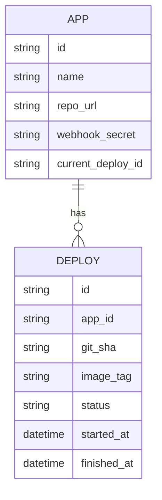
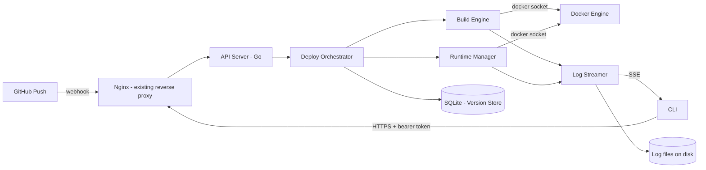

# Stevedore — System Plan

A self-hosted mini-PaaS: git push → build → deploy → rollback, with log streaming.
Built to demonstrate real DevOps/infrastructure depth and to formalize/replace the
manual VPS deploy process currently used for two production apps
(Bulawang Ani, JPMC ERP).

---

## Phase 0 — Problem & Scope

### Problem Statement
The current deploy process for the two existing apps is manual/scripted per project:
GitHub Actions + a deploy script + SSH steps, with no rollback mechanism, no unified
live log view during a deploy, and no reliable answer to "did this actually succeed"
beyond checking manually. Stevedore replaces that with one consistent, safer,
observable deploy path.

### Scope Decision
Single operator, multiple apps, Dockerfile-based (no buildpack/language
auto-detection). Single bearer-token auth, not RBAC. CLI + minimal HTTP API as the
interface; web dashboard is explicitly a stretch goal, not MVP. Deliberately **not**
multi-tenant — there are no other users yet, and tenant isolation is a distinct,
much larger project that shouldn't be half-built in advance of an actual need.

### MVP — Definition of Done
- Push to a designated branch → webhook triggers a build automatically
- Webhook is signature-verified (HMAC, non-negotiable — this is an RCE-adjacent
  surface, not a nice-to-have)
- Build runs in an isolated, ephemeral container — never directly on host
- Failed build never touches the running deployment (no partial/broken deploy state)
- Successful build deploys with a health check before cutover; failed health check
  auto-rolls-back to the previous container
- Every deploy is versioned; `rollback` reverts to a previous version on command
- Live log streaming during build + deploy, plus retrievable historical logs after
- CLI + API can trigger deploy, rollback, check status, tail logs
- Proven end-to-end on one real app before the second

### Explicitly Out of Scope (MVP)
- Multi-tenancy / cross-user isolation
- Web dashboard
- Buildpacks / non-Dockerfile builds
- Multi-server orchestration (K8s) — single VPS target
- Secrets vault integration — plain env files for now (named gap, not silent)
- Auto SSL provisioning — reuse existing Certbot/Nginx setup
- Deploy notifications (Slack/email)

### Open item to resolve before writing the Build Engine
Image/log retention policy (e.g. "keep last 5 images per app") — needed before disk
usage becomes a real problem, not after.

---

## Phase 1 — Tech Stack

### Agent / CLI Language: Go (standard-library-first)
Chosen deliberately over Node/TS despite the added learning curve, because:
- Go is the native language of this ecosystem (Docker, containerd, Kubernetes all
  written in it) — building in it means working with the same primitives the
  orchestrated tools use, which is a deeper form of the depth this project is for.
- No hard deadline + explicit willingness to learn new tools removes the main
  argument against it (finishing-risk from stacking a new language on a new domain).

**Guardrail:** stick to the standard library for MVP (`net/http`, `os/exec`,
`encoding/json`, the official Docker Go SDK). Avoid web frameworks (Gin/Echo) or CLI
frameworks (Cobra) until the stdlib version works — adding framework abstractions
while still learning the language and the domain is a third simultaneous unknown,
not a shortcut.

### API Style
Plain REST over `net/http`. No GraphQL (single consumer — your own CLI — gains
nothing from it). No API versioning (single consumer you control, so version skew
isn't a real risk here).

### Database
SQLite (via a pure-Go driver, e.g. `modernc.org/sqlite`, to keep the build a static
binary with no cgo/C toolchain dependency). This is bookkeeping for one operator's
deploy history, not application data — no reason to run a second DB server alongside
the MySQL you already operate for the real apps.

### Build Isolation
Docker socket mount (`/var/run/docker.sock`) into the agent process — the agent asks
the host Docker daemon to build/run, rather than nesting Docker engines
(true Docker-in-Docker has known volume/networking issues and isn't needed here).

### Log Streaming Transport
Server-Sent Events (SSE), not websockets — logs are one-directional (server →
client); SSE gives auto-reconnect and plain-HTTP simplicity for free. Websockets
would only be justified by a need for bidirectional control (e.g. interactive shell),
which is out of scope.

### Concurrency Model
- Each deploy runs in its own goroutine; different apps deploy fully in parallel.
- Build/runtime process output streams into a channel that fans out to N SSE
  subscribers (design for more than one log viewer even solo).
- **Per-app mutex / dedicated deploy-worker goroutine** serializes deploys *for that
  app* specifically, to prevent two overlapping deploys of the same app (rapid
  double-push, webhook retry) from racing and corrupting rollback state. Other apps
  are unaffected and continue to deploy in parallel.

### Architectural Constraint (explicit, not accidental)
SQLite + Docker-socket-mount means the agent **must run on the same host** as the
apps it manages — no remote-multi-server story in this design. Correct for the
current single-VPS reality; worth remembering later if that changes.

---

## Phase 2 — System Architecture

### Module Breakdown

- **Webhook Receiver** — verifies GitHub HMAC signature per app before enqueuing a
  deploy job. Does not build inline; keeps the HTTP handler fast.
- **Deploy Orchestrator** — owns the per-app mutex/goroutine. The only module allowed
  to mutate an app's "current live version." Runs: pull → Build Engine → Runtime
  Manager → record in Version Store.
- **Build Engine** — wraps the Docker SDK; builds from the app's Dockerfile, tags
  `{app}:{git-sha}-{timestamp}`; streams build output into the Log Streamer live
  rather than buffering to the end.
- **Runtime Manager** — stops the current container (keeps its image for rollback),
  starts the new one, health-checks with retries. On failure: stops the new
  container, restarts the previous one, marks the deploy `failed` (automatic
  rollback-on-bad-health, distinct from manual rollback).
- **Version Store (SQLite)** — source of truth for what's live and what can be
  rolled back to.
- **Log Streamer** — per-deploy channel fanned out to SSE subscribers; also flushes
  to a per-deploy log file on disk so historical logs survive after the process ends.
- **CLI** — talks only to the API Server over HTTP with a bearer token; no direct
  Docker/DB access, so a future dashboard can be added without touching the CLI.
- **API Server** (`net/http`) — owns auth and routes to the modules above.

### Entities (ERD)



Log content lives as files on disk (`logs/{app}/{deploy_id}.log`), not DB rows —
unbounded, append-only, sequential-read data doesn't belong in SQLite.

### API Design

- `POST /webhook/:app` — HMAC-verified GitHub webhook target
- `POST /apps/:app/deploy` — manual trigger (CLI)
- `POST /apps/:app/rollback` — revert to previous successful deploy
- `GET /apps/:app/status` — current state + last deploy result
- `GET /apps/:app/logs?deploy_id=` — SSE stream if live, file read if historical
- `GET /apps` — list registered apps

### Architecture Diagram



Reuses the existing Nginx/Certbot setup as the public entry point — the Go server
does not terminate TLS itself.

---

## Phase 3 — Project Structure

```
stevedore/
├── cmd/
│   ├── agent/
│   │   └── main.go              # entrypoint for the API server/daemon
│   └── cli/
│       └── main.go              # entrypoint for the CLI binary
├── internal/
│   ├── webhook/
│   │   └── receiver.go          # HMAC verification + job enqueue
│   ├── orchestrator/
│   │   └── orchestrator.go      # per-app mutex, deploy pipeline coordination
│   ├── build/
│   │   └── engine.go            # Docker SDK build calls, image tagging
│   ├── runtime/
│   │   └── manager.go           # container start/stop, health checks, auto-rollback
│   ├── store/
│   │   ├── sqlite.go            # connection + migrations
│   │   └── models.go            # App, Deploy structs + queries
│   ├── logstream/
│   │   └── streamer.go          # channel fan-out + file persistence
│   └── api/
│       ├── server.go            # http.Server setup, middleware (auth)
│       └── handlers.go          # route handlers, thin — delegate to internal/*
├── migrations/
│   └── 0001_init.sql
├── logs/                        # runtime log files (gitignored)
├── go.mod
└── go.sum
```

**`internal/` is load-bearing, not just convention** — Go's compiler enforces that
code outside this module can't import anything under `internal/`, which is a hard
guarantee that `cmd/cli` can't bypass the API and reach `internal/store` or Docker
directly.

One package per directory under `internal/`; package name matches the directory.
Avoid a generic `utils`/`common` package — the most common Go anti-pattern, becomes
a dumping ground. Handlers in `api/handlers.go` stay thin: parse request, call into
`orchestrator`/`store`, write response — no business logic in the HTTP layer.

---

## Phase 4 — Security & Auth

### Authentication
Single bearer token, generated once at setup, stored in an env file the agent reads
on boot (`AGENT_API_TOKEN`). CLI reads the same token from `~/.mini-paas/config` (or
`~/.stevedore/config`) and sends it as `Authorization: Bearer <token>`. No login flow,
sessions, or refresh — one credential, one holder.

### Webhook Authentication (separate threat model)
GitHub signs payloads with a per-repo secret via HMAC-SHA256 (`X-Hub-Signature-256`).
Verify on every request using constant-time comparison (`hmac.Equal`, not `==`).
Each app gets its own webhook secret — no reuse across apps.

### Authorization
Not applicable at MVP scope — one token, full access to all registered apps. Stated
explicitly as a decision, not an oversight.

### Security Checklist
- [ ] Webhook signature verification (`hmac.Equal`) before touching the queue
- [ ] API token check on every non-webhook route, constant-time comparison
- [ ] Input validation on app names (restricted charset — they become Docker
      image/container names and file path segments; unsanitized input here is a
      path-traversal/injection vector)
- [ ] No shell-string command construction — pass args as a slice to
      `exec.Command(name, arg1, arg2)`, never `sh -c` + `fmt.Sprintf`
- [ ] Agent process runs as a dedicated non-root system user (in the `docker` group),
      not root, despite needing socket access
- [ ] App env files (DB creds etc.) never logged — Log Streamer must not capture
      `docker run -e KEY=value` invocations verbatim
- [ ] HTTPS enforced via existing Nginx/Certbot; agent itself can stay plain HTTP
      internally
- [ ] `govulncheck` run periodically (manual is fine at this scale)
- [ ] API error responses are generic; detailed errors go to server-side logs only
- [ ] Basic rate limiting on the webhook endpoint (per-IP/per-app)

**Named gap, not a silent one:** no secrets vault (Vault/SOPS) — plain env files for
MVP. Revisit if Stevedore ever manages apps with more sensitive data.

---

## Phase 5 — CI/CD Pipeline (for Stevedore's own repo)

Distinct from the deploy pipeline Stevedore runs for other apps — this is how
Stevedore itself ships.

### Pipeline Stages
1. Trigger: push to `main`
2. Install & cache: `go mod download`, cached by `go.sum`
3. Lint: `gofmt -l .` (fail on any output) + `go vet ./...` + `staticcheck`
4. Test: `go test ./...` — prioritize webhook signature verification (security
   boundary) and orchestrator mutex behavior (concurrency correctness boundary)
   over exhaustive coverage at MVP stage
5. Build: `go build` → static `agent` and `cli` binaries (no asset-compilation step)
6. Security scan: `govulncheck ./...`
7. Deploy: build binaries in CI, `scp` to VPS, restart via systemd — deliberately
   simpler than Stevedore's own deploy mechanism; the tool must not depend on
   itself being healthy mid-upgrade to ship its own upgrades
8. Post-deploy smoke test: hit the agent's own `/apps` endpoint after restart

### Branch Strategy
Trunk-based, single `main`. GitFlow solves multi-contributor coordination problems
that don't exist here.

### Environment Strategy
Two: local and production. No staging tier — no second VPS, and standing one up
purely for staging would work against the free-tier/personal-project constraint.

### CI Skeleton (GitHub Actions)
```yaml
name: build-and-deploy
on:
  push:
    branches: [main]

jobs:
  build:
    runs-on: ubuntu-latest
    steps:
      - uses: actions/checkout@v4
      - uses: actions/setup-go@v5
        with:
          go-version: '1.22'
      - run: gofmt -l . | tee /dev/stderr | (! read)
      - run: go vet ./...
      - run: go test ./...
      - run: govulncheck ./...
      - run: go build -o agent ./cmd/agent
      - run: go build -o cli ./cmd/cli
      - uses: actions/upload-artifact@v4
        with:
          name: binaries
          path: |
            agent
            cli

  deploy:
    needs: build
    runs-on: ubuntu-latest
    steps:
      - uses: actions/download-artifact@v4
        with:
          name: binaries
      - name: Copy binary and restart service
        run: |
          scp -o StrictHostKeyChecking=no agent ${{ secrets.VPS_USER }}@${{ secrets.VPS_HOST }}:/opt/stevedore/agent.new
          ssh -o StrictHostKeyChecking=no ${{ secrets.VPS_USER }}@${{ secrets.VPS_HOST }} \
            'sudo systemctl stop stevedore && mv /opt/stevedore/agent.new /opt/stevedore/agent && sudo systemctl start stevedore'
```

---

## Phase 6 — DevOps Setup

### Server / Hosting
Runs on the existing Hostinger VPS alongside Bulawang Ani and JPMC ERP — no new
infrastructure. No orchestration layer (Compose/K8s) for the agent itself, since
it's a single static binary, not a multi-container stack. The apps *being deployed*
run as individual Docker containers; the agent managing them is a plain systemd
service.

### Process Management
**systemd**, not Supervisor — the agent is a single long-running Go binary with no
worker pool to supervise, and systemd is already PID 1 on Ubuntu 24.04, giving
restart-on-failure, boot-start, and journald integration without adding a second
process supervisor alongside the OS's own.

```ini
# /etc/systemd/system/stevedore.service
[Unit]
Description=stevedore agent
After=network.target docker.service
Requires=docker.service

[Service]
Type=simple
User=stevedore
ExecStart=/opt/stevedore/agent
Restart=on-failure
RestartSec=5
EnvironmentFile=/opt/stevedore/agent.env

[Install]
WantedBy=multi-user.target
```

### Database Operations
- **Backup:** daily cron running `sqlite3 data.db ".backup backups/data-$(date +%F).db"`
  (safe against a live DB, no downtime), 7-day retention.
- **Migrations:** versioned SQL files (`0001_init.sql`, `0002_...sql`) applied on
  startup via a `schema_version` table check — no migration framework needed yet.
- **Connection pooling:** not applicable (single-file, single-process SQLite).

### Monitoring & Observability
Deliberately minimal for solo-operator scope:
- Skip Sentry/equivalent — structured logs to journald are sufficient signal for
  one operator watching CLI output
- Add a free-tier external uptime check (UptimeRobot or similar) pinging `/apps` —
  worth having even solo, since "the agent silently died" is otherwise invisible
- No separate log aggregation stack — Log Streamer's per-deploy files + journald
  cover it
- Deploy success/failure rate is queryable directly from the Version Store; no
  separate metrics system needed at this scale

### SSL & Domain
Unchanged — existing Certbot/Nginx setup, extended with a subdomain
(e.g. `stevedore.yourdomain.com`) if external reachability is wanted, rather than
the agent terminating TLS itself.

---

## Summary of Key Decisions

| Decision | Choice | Why |
|---|---|---|
| Scope | Single-operator, multi-app, no multi-tenancy | No real users yet; tenant isolation is a distinct, much larger project |
| Language | Go, stdlib-first | Native to the ecosystem being orchestrated; depth over speed, deadline allows the ramp-up |
| Interface | CLI + minimal API | Dashboard explicitly deferred to keep MVP finishable |
| Database | SQLite | Bookkeeping only, no reason for a second DB server |
| Concurrency | Per-app mutex + goroutines + channel fan-out | Parallel across apps, serialized within an app to prevent race corruption |
| Process manager | systemd | Native to the OS, no second supervisor needed |
| Environments | Local + production only | No second VPS; staging isn't worth the cost here |
